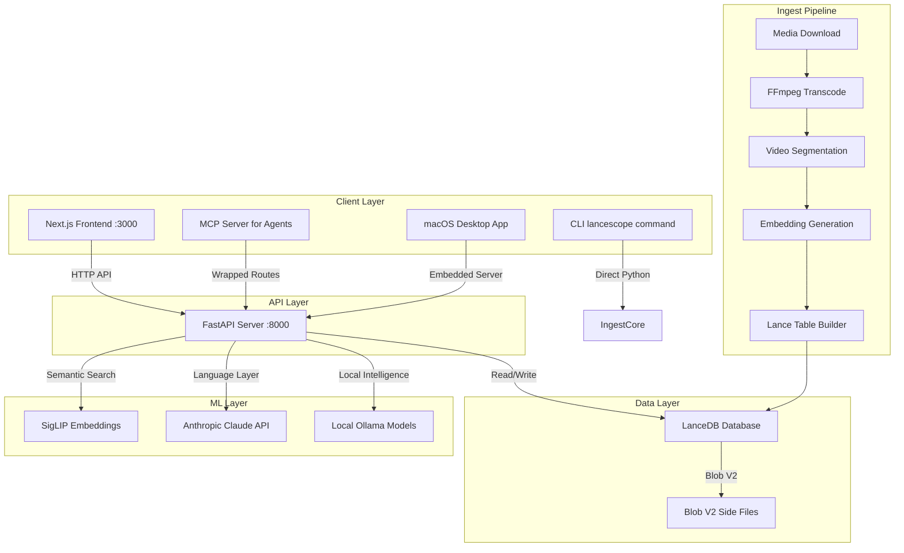
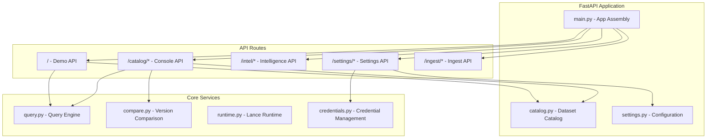
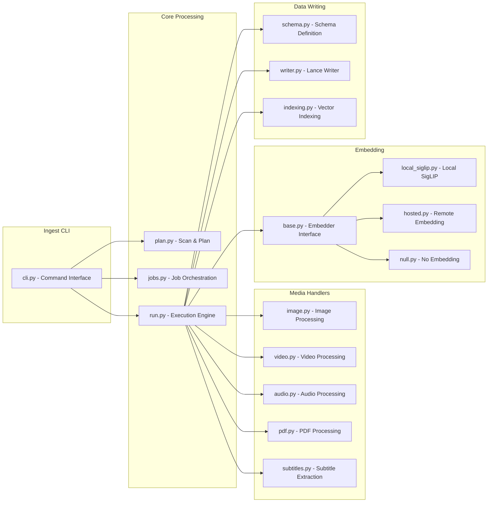
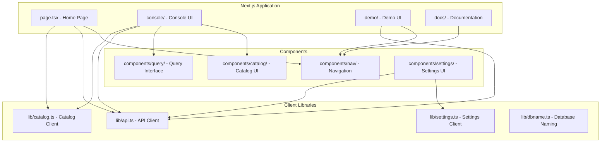

# Architecture

How LanceScope works — the components, the data flows, and the design decisions that make it a Lance-aware workbench rather than a generic database tool.

## System overview

LanceScope is a multi-interface system for reading and understanding LanceDB databases. It provides four ways to interact with the same underlying functionality:

- **Web console** at `/console` — the primary interface for browsing databases
- **CLI tool** via `lancescope` command — headless ingestion and scanning
- **MCP server** for AI agents — exposes read operations to Claude Code and other agent hosts
- **macOS desktop app** — self-contained application with embedded server

### High-level architecture



### Key components

**FastAPI Backend** (`server/`)
- Serves HTTP API on port 8000
- Organized into route modules: catalog, demo, intel, settings, ingest
- Manages dataset handles through a central catalog
- Tracks IO costs for every operation

**Next.js Frontend** (`web/`)
- Runs on port 3000 during development
- Static export for desktop app and production builds
- Provides console, demo, and documentation interfaces
- Type-safe API client libraries

**Ingest Pipeline** (`ingest/`)
- Media processing with handlers for images, video, audio, PDFs
- Embedding generation with multiple backend options
- Lance table construction with proper indexing
- CLI and web interface share the same core logic

**Intelligence Layer** (`server/intel/`)
- Optional AI features for natural language queries
- Support for Claude, Ollama, and OpenAI-compatible APIs
- Local model hosting for offline operation
- Cost tracking for inference operations

### Data flow patterns

**Console Query Flow**
1. UI requests table list → FastAPI catalog routes
2. Catalog opens Lance dataset with scoped handle
3. Lance reports schema, stats, versions
4. Catalog drains IO counter for cost reporting
5. Response includes data + byte cost

**Demo Search Flow**
1. UI submits search query → FastAPI demo routes
2. Query embedded using SigLIP (local or hosted)
3. Vector search over LanceDB with scoped handle
4. Results returned with search cost
5. Video playback opens blob handles with separate cost tracking

**Ingest Pipeline Flow**
1. CLI scans source directory → capability checks
2. Media handlers decode files → extract metadata
3. Embedder processes batches → generate vectors
4. Lance writer commits batches → build indices
5. Progress reporting throughout with stage tracking

## Implementation details

### Server architecture

The FastAPI application is assembled in `server/main.py` with clear separation of concerns:



### Catalog scoping design

A critical design pattern in LanceScope is **dataset handle scoping**. Every operation that opens a Lance dataset goes through the `Catalog` class, which:

- Maintains an LRU cache of open datasets (max 32 handles)
- Assigns each handle a scope (e.g., "console", "demo") 
- Provides isolated IO counters per handle via `io_stats_incremental()`
- Pins critical handles (like demo's segments) to prevent eviction

**Why this matters**: Lance's `io_stats_incremental()` is a drain — it reports bytes since the last call *and resets the counter*. Two callers sharing one dataset object would silently steal each other's numbers. By scoping handles, the console browsing a table gets a different dataset object from the demo's byte instrument, and neither can perturb the other's counter.

### Ingest pipeline architecture

The ingest system is built around a pipeline architecture with clear stages:



**Key design principles**:
- **Capability detection**: System reports what it can/cannot decode rather than failing silently
- **Progress reporting**: Unified tracking across CLI and web interfaces with ETA calculation
- **Batch processing**: Rows committed in batches for crash recovery
- **Error isolation**: One file's failure doesn't stop the entire pipeline

### Web frontend architecture

The Next.js application uses the App Router with a clear component hierarchy:



### IO cost tracking

IO cost tracking is fundamental to LanceScope's design. Every API response includes byte costs measured via Lance's `io_stats_incremental()`:

**How it works**:
1. Each scoped handle has its own IO counter
2. Counter is drained before operation (to zero it)
3. Operation executes
4. Counter is drained after operation (to measure cost)
5. Cost is included in API response

**What gets tracked**:
- Catalog operations (listing tables, reading schema)
- Query operations (search, filtering)
- Demo operations (search, video streaming)
- Intelligence operations (inference token counts)

**Why this matters**: In Lance, the bytes a search touches and the bytes a table holds can be radically different due to Blob V2. A table can hold 2.65 GB of video while a search reads kilobytes. Making this visible is the whole point of LanceScope.

### Key design patterns

**1. Route Organization**
- FastAPI routes organized by domain (catalog, demo, intel, settings, ingest)
- Each route module is self-contained with its own models and logic
- Routes are bound to catalog instance at startup
- CORS middleware configured for Next.js frontend

**2. Media Handler Pattern**
- Abstract base class for media handlers
- Each media type has dedicated handler (image, video, audio, PDF)
- Capability detection reports what each build can decode
- Handlers report missing dependencies rather than failing

**3. Embedder Abstraction**
- Base embedder interface with multiple implementations
- Local SigLIP for offline processing
- Hosted embedders for remote processing
- Null embedder for testing without ML

**4. Progress Reporting**
- Unified progress tracking across CLI and web
- Progress stages: scanning, decoding, embedding, writing, indexing
- ETA calculation after minimum sample size
- JSON output for programmatic consumption

**5. Read-Only Console**
- Console intentionally cannot write to datasets
- Only route that may write is `/ingest/*`, and it says it cannot yet
- Prevents accidental modifications to production data
- Clear separation between reading and writing concerns

## File structure

```
lancedb/
├── server/                 # FastAPI backend
│   ├── main.py            # App assembly
│   ├── catalog.py         # Dataset catalog with IO tracking
│   ├── query.py           # Query engine
│   ├── compare.py         # Version comparison
│   ├── settings.py        # Configuration management
│   ├── mcp_server.py      # MCP server for agents
│   └── routes/            # API route modules
│       ├── catalog.py     # Console API
│       ├── demo.py        # Demo API with byte meter
│       ├── intel.py       # Intelligence API
│       ├── settings.py    # Settings API
│       └── ingest.py      # Ingest API
├── ingest/                # Media ingestion pipeline
│   ├── cli.py             # Command-line interface
│   ├── core/              # Core processing logic
│   │   ├── run.py         # Execution engine
│   │   ├── plan.py        # Scan & planning
│   │   ├── jobs.py        # Job orchestration
│   │   ├── writer.py      # Lance writer
│   │   ├── schema.py      # Schema definitions
│   │   ├── indexing.py    # Vector indexing
│   │   ├── media/         # Media handlers
│   │   └── embedders/     # Embedding implementations
│   ├── download.py        # Media downloaders
│   └── prepare.py         # Video preparation
├── web/                   # Next.js frontend
│   ├── app/               # App router pages
│   │   ├── page.tsx       # Home page
│   │   ├── console/       # Console UI
│   │   ├── demo/          # Demo UI
│   │   ├── docs/          # Documentation
│   │   ├── components/    # React components
│   │   └── lib/           # Client libraries
│   └── package.json       # Node dependencies
├── desktop/               # macOS app packaging
├── scripts/               # Utility scripts
├── tests/                 # Test suite
└── docs/                  # Documentation
    └── guide/             # This guide
```

## Key architectural insights

1. **Single Database Architecture**: The demo stores video embeddings and video blobs in the same LanceDB table, enabled by Blob V2's lazy loading — this is the core technical claim LanceScope demonstrates.

2. **IO-First Design**: Every operation reports byte costs, making performance visible. This is fundamental to the tool's purpose — Lance makes cost the surprising number, so LanceScope makes cost visible.

3. **Scope Isolation**: Dataset handles are scoped to prevent IO counter pollution between different operations. This ensures accurate cost tracking across concurrent operations.

4. **Capability Detection**: The system reports what it can and cannot do rather than failing silently. This provides clear feedback about missing dependencies or unsupported features.

5. **Dual Interface**: Both CLI and web interface use the same core processing logic, ensuring consistent behavior across different usage patterns.

6. **Read-Only Console**: The console intentionally prevents dataset modifications, providing a safe environment for exploring production databases.

7. **Intelligence Layer**: Optional AI features work with multiple providers (Claude, Ollama, OpenAI-compatible) with local hosting support for offline operation.

8. **Agent Integration**: MCP server exposes read operations to AI agents, allowing tools like Claude Code to inspect LanceDB databases directly.

9. **Version Pinning**: Catalog supports opening specific dataset versions for coherent comparisons, enabling before/after analysis.

10. **Blob Caching**: Demo caches blob files to enable efficient video seeking without re-reading data, demonstrating practical Blob V2 usage patterns.

## Related documentation

- [Getting started](/docs/start-here) — practical introduction to using LanceScope
- [Why cost is the unit](/docs/explain-cost) — deeper explanation of IO tracking philosophy
- [Connect a database](/docs/howto-connect) — how to point LanceScope at your data
- [Diagnose a slow query](/docs/howto-diagnose) — using the architecture to understand performance
- [Reference: HTTP API](/docs/reference-http-api) — complete API documentation
- [Reference: Query modes](/docs/reference-query) — detailed query implementation details